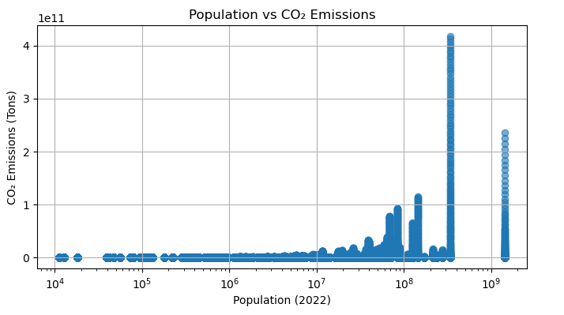
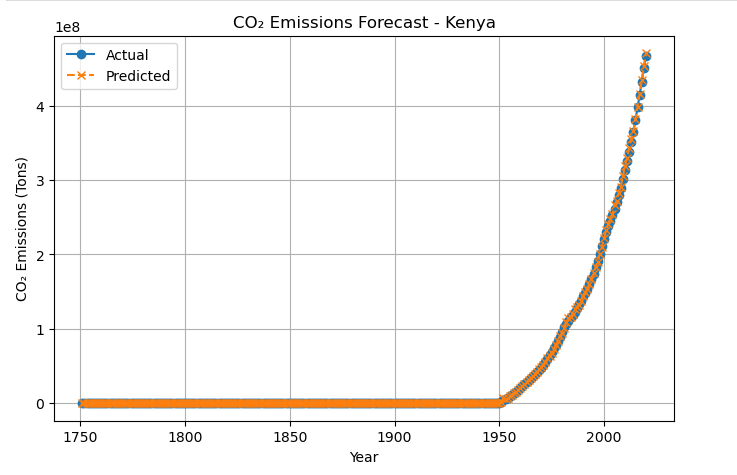

# 🌍 CO₂ Emission Prediction Using Machine Learning

## 📖 Overview
This project focuses on **predicting CO₂ emissions by country** using machine learning techniques to support the **United Nations Sustainable Development Goal (SDG) 13: Climate Action**.  
By analyzing emission data, this model helps identify high-emitting countries and provides insights for sustainable policy decisions aimed at reducing carbon footprints.

---

## 🎯 Objectives
- Analyze CO₂ emissions data by country and year.  
- Build and compare machine learning models for emission prediction.  
- Visualize emission trends to identify key contributors to climate change.  
- Support data-driven climate action and sustainability strategies.

---

## 🧠 Machine Learning Approach
Two regression algorithms were applied:
1. **Linear Regression** – for simple, interpretable trend estimation.  
2. **Random Forest Regressor** – for non-linear pattern recognition and improved accuracy.

Both models were trained using the dataset `CO2 emission by countries.csv`.

---

## 📊 Model Performance

| Model              | MAE (Mean Absolute Error) | R² Score |
|--------------------|---------------------------|----------|
| Linear Regression  | 22,679,442.020            | 1.000    |
| Random Forest      | 12,887,382.283            | 1.000    |

✅ The **Random Forest model** achieved a lower MAE, indicating **better prediction accuracy**.

---

## 📈 Visualizations
The following visual insights were generated:
## 📈 Visualizations

### 1️⃣ Top 10 CO₂ Emitting Countries


### 2️⃣ CO₂ Emission Trend for Selected Country


### 3️⃣ Predicted vs Actual CO₂ Emissions



These visualizations highlight emission disparities and the effectiveness of prediction models.

---

## ⚙️ Technologies Used
- **Python** 🐍  
- **Pandas** – Data manipulation  
- **Matplotlib & Seaborn** – Visualization  
- **Scikit-learn** – Machine learning  

---

## 💡 Ethical Considerations
- The data was used responsibly to **raise awareness** about global CO₂ emissions.  
- The model results should be used for **policy support**, not as absolute predictions.  
- Care was taken to **avoid bias** and ensure fair interpretation across countries.

---

## 🚀 How to Run
1. Clone the repository:
   ```bash
   git clone https://github.com/yourusername/co2-emission-prediction.git
